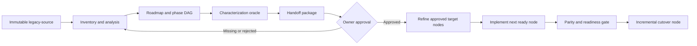

# Mainframe Modernization with GitHub Copilot

This folder configures GitHub Copilot in VS Code to modernize an evidence-backed mainframe application into the repository's fixed target:

- React with TypeScript for the frontend.
- Spring Boot for APIs, application services, and domain rules.
- Azure SQL Database for converted relational persistence.

The workflow deliberately separates **legacy discovery** from **target implementation**. Copilot must understand and characterize a bounded legacy behavior before it designs or generates replacement code.

## How the Customizations Work

| Customization | Purpose | When it applies |
|---|---|---|
| [copilot-instructions.md](copilot-instructions.md) | Repository-wide safety and architecture invariants | Every Copilot request in this workspace |
| [Mainframe Modernization agent](agents/mainframe-modernization.agent.md) | Creates, resumes, and executes the persistent modernization roadmap and phase DAG | Select it from the VS Code agent picker when modernizing an application or slice |
| [Mainframe Evidence Reviewer agent](agents/mainframe-evidence-reviewer.agent.md) | Read-only assessment of a discovery handoff | Invoked by the coordinator before target work; it cannot approve work for a human owner |
| [Discovery skill](skills/modernize-mainframe-application/SKILL.md) | Extraction reconciliation, dependency analysis, rule recovery, behavior characterization, slice ordering, roadmap, and DAG creation | Before target design or implementation |
| [Implementation skill](skills/modernize-mainframe-react-spring-azure-sql/SKILL.md) | Expands stable target milestones with approved executable nodes for architecture, contracts, code, tests, coexistence, and cutover | Only after the corresponding discovery handoff is approved |
| [Scoped instructions](instructions/) | Technology and path-specific coding rules | Automatically when relevant frontend, backend, database, local SQL, E2E, or legacy files are involved |

### Agent

An agent coordinates a role and controls which tools and subagents it may use. The **Mainframe Modernization** agent can inspect files, create the evidence-backed plan, execute its next unblocked node, edit the target, run checks, and delegate the read-only handoff assessment.

Use the agent for an end-to-end modernization conversation. Discovery creates one persistent roadmap and dependency DAG. On later requests, the agent reconciles the DAG with the status ledger and resumes the next dependency-satisfied executable node instead of asking you to reconstruct the sequence. It pauses at missing evidence and explicit accountable-owner approval nodes because those cannot be automated safely.

### Skills

A skill is a detailed, reusable procedure loaded when its description matches the task. This repository has two skills with a strict approval boundary:



The discovery skill creates coarse target milestones and their dependencies, but must not generate target architecture, DDL, or application code. After approval, the implementation skill expands those stable milestones with executable child nodes without inventing or redoing unapproved legacy behavior recovery.

The coordinator uses three persistent files:

- `modernization/plan/modernization-roadmap.md`: human-readable phases, slices, gates, owners, and completion criteria.
- `modernization/plan/phase-dag.json`: machine-readable nodes and dependencies.
- `modernization/plan/status.md`: execution ledger containing actual results, blockers, approvals, and the next eligible node.

The DAG establishes dependency order. Only work and approval nodes execute; milestones group their children. Readiness prerequisites and completion criteria are separate. Human decisions are explicit approval nodes with accountable role, approver identity, decision, timestamp, scope, source/handoff/roadmap revisions, conditions or expiry, and evidence. The coordinator executes one ready node at a time in topological order; independent branches may exist, but a blocked or approval-gated predecessor is never skipped.

`phase-dag.json` defines the graph and caches current status. `status.md` is the append-only authority for transitions, using sequenced JSON records and an allowed-transition table. Each transition is validated and written to the ledger first and then cached in the DAG; malformed, conflicting, or mismatched state blocks further execution until reconciled.

### Instructions

Instructions are guardrails that Copilot loads automatically according to the files and task involved:

- `legacy-source/**`: immutable forensic evidence; never edited or normalized in place.
- `target/react-spring-azure-sql/frontend/**`: React, TypeScript, accessibility, browser security, and API contract rules.
- `target/react-spring-azure-sql/backend/**`: Spring Boot, domain, transaction, authorization, and integration rules.
- Database and migration paths: Azure SQL types, schemas, constraints, migration-chain, and compatibility rules.
- Backend test and local database paths: SQL Server/Testcontainers inner-loop rules without creating a second dialect.
- `tests/e2e/**`: user-task, accessibility, differential parity, rollback, and restart evidence.

You normally do not attach these manually. Work in the correct repository path and Copilot applies the matching instructions.

## Required Repository Layout

```text
legacy-source/                         # Immutable extracted mainframe evidence
modernization/
  inventory/                          # Extraction manifest and reconciliation
  analysis/                           # Dependencies, rules, interfaces, and data
  plan/                               # Roadmap, phase DAG, and execution ledger
  evidence/characterization/          # Approved legacy inputs and outcomes
  handoff/                            # Bounded discovery packages and approvals
  react-spring-azure-sql/             # Target analysis, design, plans, and evidence
target/react-spring-azure-sql/
  frontend/                           # React and TypeScript
  backend/                            # Spring Boot and migrations
  database/                           # Database support and reconciliation
  tests/e2e/                          # Integrated user-task and parity tests
```

Do not place generated code, notes, or normalized files under `legacy-source/`.

## Using the Mode in VS Code

1. Open this repository as the VS Code workspace.
2. Open Copilot Chat and select **Mainframe Modernization** from the agent picker.
3. Describe the application boundary and ask the agent to create and execute the phased modernization roadmap.
4. The agent completes inventory and analysis, then writes the roadmap, dependency DAG, execution ledger, characterization work, and bounded handoffs.
5. At each gate, obtain the named accountable-owner approval. The evidence reviewer can assess readiness, but cannot grant approval.
6. Tell the same agent to continue. It reconciles the DAG status cache with the ledger, selects the next ready executable node, and invokes the correct skill for that phase.
7. Review each reported node transition, evidence, commands, actual results, mismatches, risks, and rollback status.

A useful initial prompt is:

```text
Create and execute an evidence-backed phased modernization roadmap for this application. During discovery, produce modernization/plan/modernization-roadmap.md, phase-dag.json, and status.md. Sequence bounded slices from inventory and dependency evidence. Execute one ready work or approval node at a time, append every transition to the ledger before updating the DAG status cache, and continue automatically until an evidence blocker or accountable-owner approval node requires me. After approval, expand and execute the same DAG for React, Spring Boot, and Azure SQL; do not create a disconnected implementation plan.
```

Skills can also be requested directly by name when you want only one phase. In Copilot Chat, use natural language such as "use the `modernize-mainframe-application` skill," or select its slash command if VS Code displays it.

## Example: Modernize SURVDEMO

SURVDEMO is the sample COBOL application under `legacy-source/SURVDEMO/`. It contains two distinct business workflows:

1. **Online survivor-income benefit inquiry** through CICS transaction `SI01`, COBOL program `SURVINQ`, and BMS map `SURVMAP`/`SURVSCR`.
2. **Month-end survivor-benefit calculation** through scheduled job `SURVMON`, procedure `SURVBAT`, calculation program `SURVCALC`, and validation subprogram `SURVVALID`.

The online workflow accepts a 12-character claim ID and 10-character beneficiary ID. It reads survivor claim, entitlement, and beneficiary data, then displays the beneficiary name, relationship, monthly amount, start date, optional end date, status, and message. The batch workflow calculates monthly payments and exceptions, updates run and entitlement state, writes fixed-length output files, and controls downstream transmission and reporting.

Modernize these as separate bounded slices. Start with the read-only `SI01` inquiry because it exercises CICS, BMS, COMMAREA, Db2 null and decimal handling, status mappings, and user-visible error behavior without the batch workflow's update, restart, and file-output risks.

### Step 1: Preserve the SURVDEMO Baseline

The current sample evidence is organized as follows:

```text
legacy-source/SURVDEMO/
  BMS/SURVMAP.bms
  COBOL/SURVINQ.cbl
  COBOL/SURVCALC.cbl
  COBOL/SURVVALID.cbl
  COPY/SURVCOM.cpy
  COPY/SURVHOST.cpy
  COPY/SURVMAP.cpy
  COPY/SURVOUT.cpy
  COPY/SURVVAL.cpy
  CSD/SURVCICS.txt
  DDL/SURVDB2.sql
  JCL/SURVMON.jcl
  PROC/SURVBAT.proc
  SCHED/SURVFLOW.txt
```

Treat this tree as immutable evidence. Preserve fixed columns, sequence fields, trailing spaces, encoding, record metadata, and source identity. Put inventories, annotations, recovered rules, normalized views, and tests under `modernization/`, never beside these files.

The first discovery task must also identify extraction evidence that is not represented in the sample, such as source revision, transfer logs, CCSID, RECFM/LRECL, Db2 bind information, and sanitized legacy executions. Record missing items as gaps; do not infer that the sample tree is a reconciled production extraction.

### Step 2: Start Discovery

Select **Mainframe Modernization** and submit:

```text
Discover SURVDEMO's online survivor-income benefit inquiry for CICS transaction SI01.

Scope:
- CICS definition: legacy-source/SURVDEMO/CSD/SURVCICS.txt
- Entry program: legacy-source/SURVDEMO/COBOL/SURVINQ.cbl
- BMS source: legacy-source/SURVDEMO/BMS/SURVMAP.bms
- Copybooks: legacy-source/SURVDEMO/COPY/SURVMAP.cpy, SURVCOM.cpy, and SURVHOST.cpy
- Db2 DDL: legacy-source/SURVDEMO/DDL/SURVDB2.sql
- Transaction SI01 inquiry is in scope.
- SURVCALC, SURVVALID, SURVMON, SURVBAT, payment creation, exception output, and month-end scheduling are excluded from this first slice except as dependency context.

Use the modernize-mainframe-application skill. Keep legacy-source immutable. Reconcile the available extraction and record missing provenance. Recover dependencies and business rules with stable IDs and exact citations. Document pseudo-conversation and COMMAREA state, map input/output fields, PF3 and MAPFAIL behavior, Db2 SQLCODE handling, CS isolation, null end-date indicators, character padding, status precedence, relationship mappings, decimal formatting, identity, security, and error messages. Define the smallest authoritative characterization cases. Do not create React, Spring Boot, Azure SQL design, DDL, or target code. Record blockers instead of inventing missing behavior.

Create the application modernization roadmap, dependency DAG, and execution ledger. Sequence SI01 inquiry and the SURVMON month-end flow from recovered dependencies, evidence readiness, risk, and business value. Include discovery, oracle, handoff, owner approval, design, implementation, validation, coexistence, rollback, and cutover nodes. Execute ready discovery nodes sequentially and stop at the first evidence or owner-approval gate that cannot be satisfied.
```

Expected discovery artifacts include:

```text
modernization/inventory/artifact-inventory.json
modernization/inventory/artifact-inventory.csv
modernization/inventory/reconciliation.md
modernization/analysis/dependency-graph.mmd
modernization/analysis/business-rules.csv
modernization/analysis/data-dictionary.csv
modernization/analysis/unknowns-and-risks.csv
modernization/plan/modernization-roadmap.md
modernization/plan/phase-dag.json
modernization/plan/status.md
modernization/evidence/characterization/
```

Before target work, review the proposed slice ordering and DAG gates. For SURVDEMO, the evidence may support `SI01` inquiry before `SURVMON` batch, but discovery must record the actual rationale and dependencies rather than treating this README's example as approval.

Candidate IDs to confirm during discovery include:

- `ENTRY-SURV-ONL-001`: CICS transaction `SI01` invoking `SURVINQ`.
- `IFACE-SURV-ONL-001`: `SURVSCR` claim and beneficiary inquiry map.
- `STATE-SURV-ONL-001`: pseudo-conversational `SURVCOM` COMMAREA behavior.
- `RULE-SURV-ONL-001`: claim ID is required before beneficiary ID evaluation.
- `RULE-SURV-ONL-002`: beneficiary ID is required.
- `RULE-SURV-ONL-003`: relationship codes `SPS`, `CHD`, and `DEP` map to display text; other values map to `UNKNOWN`.
- `RULE-SURV-ONL-004`: claim, beneficiary, and entitlement statuses determine display status and message in source-defined precedence.
- `RULE-SURV-ONL-005`: monthly amount uses signed edited output with two decimal places.
- `DATA-SURV-ONL-001`: Db2 join over `SURVIVOR_CLAIM`, `SURVIVOR_ENTITLEMENT`, and `BENEFICIARY`.
- `ORACLE-SURV-ONL-001`: active entitlement inquiry.
- `ORACLE-SURV-ONL-002`: blank claim ID.
- `ORACLE-SURV-ONL-003`: blank beneficiary ID.
- `ORACLE-SURV-ONL-004`: entitlement not found (`SQLCODE +100`).
- `ORACLE-SURV-ONL-005`: service unavailable for another SQL error.

These are proposed catalog identifiers, not proof of complete behavior. Discovery must confirm each one against source and approved runtime evidence.

### Step 3: Capture and Approve the Behavior Oracle

Ask the coordinator to prepare sanitized cases using authoritative legacy results:

```text
Create the SI01 survivor-income inquiry behavior oracle from the recovered SURVDEMO rules. Include first entry, PF3 exit, MAPFAIL, blank claim ID, blank beneficiary ID, active/suspended/ended/cancelled entitlement, unapproved claim, ineligible beneficiary, unknown relationship/status, entitlement not found, technical SQL failure, null/non-null end date, maximum field lengths, negative/zero/maximum monthly amount, and authorization cases. Capture the exact 3270 fields, formatting, messages, CICS responses, COMMAREA state, SQL effects, and audit effects. Verify status precedence with overlapping non-active conditions. Normalize only owner-approved nondeterministic values. Do not invent expected results when SURVDEMO has not been executed in an authoritative legacy environment.
```

Business and mainframe owners must approve the expected results, tolerances, exclusions, and unresolved risks. Generated tests alone are not approval or parity evidence.

### Step 4: Create and Review the Handoff

Submit:

```text
Package the approved SI01 discovery as modernization/handoff/survdemo-si01-inquiry.md. Include source revision, owners, CICS entry point, artifact citations, rule/interface/data/state IDs, Db2 and failure behavior, oracle IDs, approved normalization and tolerances, nonfunctional constraints, explicit batch exclusions, unresolved risks, and approval status. Then delegate a read-only assessment to Mainframe Evidence Reviewer. Do not begin target design.
```

The reviewer returns one of:

- `READY FOR OWNER APPROVAL`
- `CONDITIONALLY READY`
- `NOT READY`

This is an assessment, not authorization. Record actual accountable-owner approval in the handoff before target work begins.

### Step 5: Design the Target Slice

After approval, submit a prompt that names the handoff explicitly:

```text
Design the approved SURVDEMO SI01 inquiry vertical slice using modernization/handoff/survdemo-si01-inquiry.md.

Use the modernize-mainframe-react-spring-azure-sql skill. First validate the handoff, then create only the approved design artifacts: task-to-route mapping, OpenAPI and error contracts, identity/authorization behavior, source-to-target data mapping, Azure SQL physical design, transaction strategy, ADRs, test plan, reconciliation, and rollback. Keep React presentation, Spring application/domain, and persistence adapters separate. Stop if the handoff lacks evidence needed for a design decision.
```

Review and approve the contracts and data mapping before asking for code. For this example, a possible target boundary is:

```text
React route       /survivor-benefits/inquiry
OpenAPI operation GET /api/survivor-entitlements/{claimId}/{beneficiaryId}
Spring use case   InquireSurvivorEntitlement
Domain rules      Approved RULE-SURV-ONL identifiers
Azure SQL objects Approved mappings for claim, entitlement, and beneficiary data
```

Names are not automatically authoritative; they must be recorded in approved design artifacts.

### Step 6: Implement One Vertical Slice

After design approval, submit:

```text
Implement only the approved SURVDEMO SI01 inquiry slice.

Start with approved SI01 characterization and contract tests. Implement dependency-free Java domain rules for relationship and status presentation, then the read-only Spring inquiry service and explicit transaction/isolation behavior, approved Azure SQL migrations and repository adapter, OpenAPI endpoint and safe errors, generated TypeScript API types, and an accessible React workflow for claim and beneficiary inquiry. Preserve blank/null distinctions, optional end date, status precedence, exact messages where contractually required, and monthly amount precision. Use decimal strings at the JSON boundary and BigDecimal in Java. Do not expose JPA entities, duplicate authoritative rules in React, connect React to the database, use H2, or implement the excluded month-end batch behavior.

After each substantive edit, run the smallest relevant executable test. Update traceability, risks, README/runbook information, reconciliation, and rollback in the same work packet.
```

Expected target locations are:

```text
target/react-spring-azure-sql/frontend/
target/react-spring-azure-sql/backend/
target/react-spring-azure-sql/backend/src/main/resources/db/migration/
target/react-spring-azure-sql/database/
target/react-spring-azure-sql/tests/e2e/
```

### Step 7: Verify Parity

Submit:

```text
Verify the integrated SURVDEMO SI01 inquiry against every approved ORACLE-SURV-ONL case. Run the frontend, domain, API contract, database integration, accessibility, security, E2E, and differential parity checks available in the repository. Apply the complete migration chain to a clean local SQL Server for inner-loop evidence and report that separately from Azure SQL Database compatibility evidence. Compare claim ID, beneficiary ID, beneficiary name, relationship, monthly amount, dates, status, message, error behavior, and authorization field by field. Do not weaken expected outcomes or call the slice equivalent while mismatches or approvals remain open.
```

The closeout should identify:

- Exact commands and exit results.
- Rule, interface, data, and oracle coverage.
- Decimal, null/blank, encoding, ordering, authorization, transaction, and failure parity.
- Accessibility and browser-task results.
- Local SQL versus Azure SQL evidence.
- Mismatches and their approved disposition.
- Rollback status and remaining gates.

### Step 8: Plan Incremental Cutover

Only after the required evidence and approvals exist, submit:

```text
Prepare an incremental cutover plan for the approved SURVDEMO SI01 inquiry slice. Define routing or coexistence with CICS transaction SI01, data synchronization and reconciliation, deployment order, observation window, abort thresholds, owners, frontend/API/database rollback, and legacy fallback. Keep SURVMON and its downstream benefit-payment workflows on the legacy path. Do not decommission SI01 until retention, audit, dependency, support, and rollback exit criteria are approved.
```

### Step 9: Modernize the Month-End Batch as a Separate Slice

After the inquiry slice is stable, begin a new discovery and approval cycle for the month-end workflow. Its evidence boundary includes:

- Scheduler definition `SCHED/SURVFLOW.txt`: last US business day at 22:00, predecessor/successor dependencies, return-code rules, duration, and restart instructions.
- Job `JCL/SURVMON.jcl` and procedure `PROC/SURVBAT.proc`: symbols, conditional report step, fixed-block 120-byte datasets, dispositions, sort control dependency, and dump/output behavior.
- Programs `COBOL/SURVCALC.cbl` and `COBOL/SURVVALID.cbl` with `COPY/SURVOUT.cpy`, `COPY/SURVVAL.cpy`, and `COPY/SURVHOST.cpy`.
- Db2 run, payment, entitlement, and exception effects defined by source and `DDL/SURVDB2.sql`.

Use a separate prompt:

```text
Discover SURVDEMO's month-end survivor-benefit calculation as a new bounded slice. Trace SURVFLOW to SURVMON, SURVBAT, SURVCALC, SURVVALID, all copybooks, Db2 objects, PAYOUT and EXCEPT records, PAYRPT sorting, return codes, commit behavior, duplicate-payment prevention, restart with a new run ID, and downstream transmission/report dependencies. Characterize successful, business-exception, technical-failure, rerun, partial-output, and duplicate-period scenarios. Keep the approved SI01 target unchanged and do not generate target batch code until this new handoff receives owner approval.
```

The batch target design must be derived from its approved handoff. Do not assume that a scheduled Spring job, an Azure service, file replacement, or orchestration mechanism is approved merely because it appears technically convenient.

## Prompts to Avoid

Avoid broad prompts such as:

```text
Convert all COBOL files to Java and React.
Rewrite this 3270 screen as a web page.
Create an Azure SQL schema from these copybooks.
Make the new application behave the same.
```

These prompts skip dependency recovery, transaction semantics, owner approval, behavior oracles, and bounded-slice controls. Use capability-oriented prompts with explicit entry points, evidence, exclusions, and gates.

## Completion Standard

A passing build is not proof of functional parity. A slice can advance only when its required evidence shows:

- Every implemented rule and interface traces to immutable legacy evidence.
- Approved oracle cases pass without unapproved normalization or tolerance changes.
- React, Spring Boot, and Azure SQL contracts agree.
- Security, accessibility, performance, recovery, and operational gates required for the slice pass.
- Data migration and reconciliation are repeatable.
- Rollback and legacy fallback are rehearsed.
- Accountable owners approve the remaining risk and cutover decision.

Until those conditions are recorded, describe the work by its actual phase and results rather than as "equivalent," "production ready," or "complete."