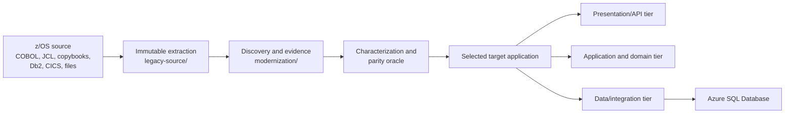

# Mainframe modernization accelerator

This repository is a working GitHub Copilot setup for incrementally modernizing
z/OS applications into a verified three-tier system. The current implementation
target is React with TypeScript, Spring Boot, and Azure SQL Database.

Start with [HOW-TO-MODERNIZE.md](HOW-TO-MODERNIZE.md) for the practical planning,
execution, validation, local setup, and prompt workflow for the selected stack.

The repository is designed for accuracy and traceability. It does not perform an unsafe one-pass COBOL translation. It first reconciles the extracted estate, recovers business behavior, builds an executable behavior oracle, designs the target, and then converts one bounded vertical slice at a time.

The extracted examples are `BANKDEMO`, `SURVDEMO`, and `TRSYDEMO`. Treat them as
immutable evidence; do not assume that every program has been modernized.

## Architecture



This repository has one implementation destination: React, Spring Boot, and
Azure SQL Database under `target/react-spring-azure-sql/`.

## What is included

```text
.github/
  copilot-instructions.md
  instructions/
    legacy-source.instructions.md
    react-frontend.instructions.md
    react-spring-backend.instructions.md
    react-spring-database.instructions.md
    react-spring-e2e.instructions.md
    react-spring-local-sql.instructions.md
    react-spring-stack.instructions.md
  skills/
    modernize-mainframe-application/
      SKILL.md
      references/
      scripts/
    modernize-mainframe-react-spring-azure-sql/
      SKILL.md
      references/

legacy-source/
  DEV1/
    BANKDEMO/
    SURVDEMO/
    TRSYDEMO/

modernization/react-spring-azure-sql/
  analysis/
  architecture/
  evidence/
  plans/

target/react-spring-azure-sql/
  frontend/                     React and TypeScript
  backend/                      Spring Boot, JDBC, and Flyway
  database/                     database support and local harness
  tests/e2e/                    browser-level checks
```

`legacy-source/` is immutable evidence. Never edit, reformat, rename, or repair files in that directory. Put annotations, recovered models, decisions, normalized views, and test evidence under `modernization/`.

## Prerequisites

For discovery and planning:

- Git
- Python 3
- GitHub Copilot in a surface that supports project agent skills, such as Copilot cloud agent, Copilot CLI, or agent mode in Visual Studio Code or JetBrains
- Zowe CLI or Zowe Explorer for a real z/OS extraction
- An authorized, least-privilege z/OS identity

For implementation, install only the selected stack:

- An organization-approved JDK capable of compiling Java 17 bytecode
- Maven 3.9 or the approved Maven wrapper when one is added
- Node.js 22.12 or newer and npm
- Docker Desktop for Testcontainers and the optional local SQL Server inner loop
- An approved Azure SQL Database validation environment for final compatibility checks

Open the repository root as the Copilot workspace. Copilot automatically receives
the repository-wide instructions from `.github/copilot-instructions.md`.
Path-specific instructions apply when it works under `legacy-source/`, the
selected `target/react-spring-azure-sql/` area, or its stack-specific
modernization artifacts.

Copilot discovers the project skill from:

```text
.github/skills/modernize-mainframe-application/SKILL.md
```

Use `modernize-mainframe-application` only for platform-neutral extraction,
inventory, and source discovery. Use
`modernize-mainframe-react-spring-azure-sql` for planning, design,
implementation, and validation. It is the only implementation skill for this
repository.

## Current implemented example

TASK-SURV-001, the SURVDEMO survivor inquiry, is implemented under
`target/react-spring-azure-sql/`. Its analysis, plan, contracts, and validation
evidence are under `modernization/react-spring-azure-sql/`.

The slice is component-validated and has local SQL evidence. It is not declared
production-ready or legacy-equivalent. Live sign-in, authenticated full-stack
browser testing, approved differential legacy evidence, and Azure SQL environment
validation remain separate gates. The frontend's `?sampleData=true` mode is a
development-only contract fixture; it does not call Spring Boot or SQL Server.

## End-to-end workflow

### 1. Establish the modernization boundary

Before downloading files, identify:

- Application and business owners
- z/OS environment and source revision
- CICS transactions and IMS entry points
- Batch jobs, scheduler definitions, JCL, and PROCs
- COBOL, PL/I, Assembler, copybooks, macros, and generated source
- Db2 DDL, packages, plans, stored procedures, and embedded SQL
- VSAM, IMS, MQ, files, reports, and external interfaces
- USS directories, scripts, configuration, and build definitions
- Nonfunctional requirements, batch windows, recovery, retention, security, and audit obligations

Do not use a broad high-level qualifier as the application boundary without confirmation from application and source-management owners.

### 2. Extract the mainframe estate

Check the help for the installed Zowe CLI version before scripting. Representative commands are:

```text
zowe zos-files download all-members "<HLQ>.<APP>.COBOL" --directory "legacy-source/<HLQ>/<APP>/COBOL" --extension .cbl --fail-fast false

zowe zos-files download data-sets-matching "<HLQ>.<APP>.**" --directory "legacy-source" --extension-map cobol=cbl,copy=cpy,jcl=jcl,proc=jcl --fail-fast false

zowe zos-files download uss-directory "/u/<app>" --file "legacy-source/uss/<app>"
```

Extract source-management metadata and external definitions separately. Bulk dataset download does not capture the entire application automatically.

For every artifact, preserve:

- Original dataset/member or USS path
- Source-management version
- DSORG, RECFM, and LRECL
- Source and destination encoding
- Text, binary, or record transfer mode
- Download result, file size, and SHA-256
- Approved reason and owner for exclusions

Never place credentials, production data, private keys, tokens, or unmasked protected information in this repository.

### 3. Create and reconcile the local inventory

Run:

```powershell
python .github/skills/modernize-mainframe-application/scripts/inventory_sources.py `
  legacy-source `
  --output modernization/inventory/artifact-inventory.json `
  --csv modernization/inventory/artifact-inventory.csv
```

Compare the generated inventory with:

- Source-management element listings
- Cataloged datasets and members
- USS file listings
- Extraction command logs
- Known CICS, Db2, IMS, MQ, VSAM, scheduler, and security definitions

Extraction passes only when:

```text
expected artifacts
= successfully extracted artifacts
+ explicitly approved exclusions
```

Resolve missing copybooks, PROCs, schemas, mapsets, macros, generated source, failed downloads, empty files, decoding problems, and duplicates before analyzing affected behavior.

### 4. Recover behavior before generating target code

Use a discovery-only prompt:

```text
Use the modernize-mainframe-application skill.

Perform extraction reconciliation and legacy discovery for <APPLICATION>
only. Treat legacy-source as immutable evidence. Inspect the inventory,
source, copybooks, JCL, scheduler definitions, database definitions,
interfaces, and characterization evidence.

Create:
- system context and entry-point inventory
- dependency graph
- business-rule catalog with stable rule IDs and source citations
- data dictionary with exact precision, scale, encoding, and null behavior
- transaction, commit, rollback, restart, ordering, and failure model
- unknowns and risk register

Do not generate target code. Do not invent missing dependencies or behavior.
```

Expected outputs belong under:

```text
modernization/react-spring-azure-sql/analysis/
```

Review the recovered rules with business, mainframe, database, security, and operations owners.

### 5. Build the behavior oracle

For each conversion slice, capture sanitized legacy:

- Inputs
- API, screen, message, report, and file outputs
- Database before-and-after states
- Status and reason-code changes
- Control totals
- Ordering
- Return codes
- Commit, rollback, failure, and restart results

Store approved cases under the selected target's evidence area, for example:

```text
modernization/react-spring-azure-sql/evidence/characterization/
```

The directory may not exist until an approved independent oracle is available.
Generated unit tests and frontend sample fixtures are not behavior oracles. Parity
must compare the target with approved legacy outcomes.

### 6. Approve the target architecture

React, Spring Boot, and Azure SQL Database are mandated by the repository
instructions. Record slice-specific architecture, security, transaction,
coexistence, and rollback decisions. The current TASK-SURV-001 decision is:

```text
modernization/react-spring-azure-sql/architecture/adrs/0001-task-surv-001-stack.md
```

Architecture prompt:

```text
Use the modernize-mainframe-react-spring-azure-sql skill.

Using the approved analysis and characterization evidence for <SLICE>,
propose the three-tier React, Spring Boot, and Azure SQL target architecture
and create the required slice-specific ADRs.

Define:
- presentation/API responsibilities
- application and domain responsibilities
- data and integration adapters
- transaction boundaries and concurrency strategy
- batch scheduling, restart, and idempotency
- identity, authorization, audit, observability, and operations
- coexistence, migration, cutover, reconciliation, and rollback

Do not implement the slice until its contracts and ADRs are approved.
```

### 7. Design the Azure SQL schema

Create the source-to-target map before generating DDL:

```text
Use the modernize-mainframe-application skill.

For <SLICE>, map every evidenced Db2 table, column, key, constraint,
default, identity, index, SQL access path, isolation clause, and SQLCODE
branch to Azure SQL Database.

Create:
- modernization/react-spring-azure-sql/architecture/database/source-to-target-map.csv
- modernization/react-spring-azure-sql/architecture/database/migration-plan.md
- an Azure SQL physical-design ADR
- modernization/react-spring-azure-sql/architecture/database/schema-verification.md

Preserve decimal precision and scale. Map Db2 TIMESTAMP date/time values
to datetime2, never SQL Server timestamp/rowversion. Explicitly decide
collation, Unicode, CHAR padding, null versus blank, identity, clustered
indexes, isolation, locking, savepoints, ordering, and UTC behavior.

List unresolved decisions and stop before DDL where evidence is missing.
```

After the mapping is approved, ask Copilot to generate versioned migrations:

```text
Generate the approved Azure SQL Database schema and migration chain for
<SLICE>. Use Azure SQL-compatible T-SQL only. Do not use SQL Server Agent,
linked servers, CLR, xp_cmdshell, filesystem access, cross-database
transactions, or Managed Instance-only features.

Apply the complete migration chain to an empty approved test database and
report the actual result. Then validate metadata, constraints, indexes,
data reconciliation, query plans, concurrency, and recovery.
```

Important default mappings:

| Db2 or mainframe meaning | Azure SQL target |
|---|---|
| `DECIMAL(p,s)` or packed decimal | `decimal(p,s)` |
| `INTEGER` | `int` |
| `BIGINT` | `bigint` |
| Db2 `DATE` | `date` |
| Db2 `TIMESTAMP` | `datetime2(6)`, subject to source precision |
| Fixed code or identifier | `char(n)` or `varchar(n)` after padding analysis |
| International name or text | `nvarchar(n)` after repertoire analysis |
| Numeric generated identity | `IDENTITY` or an approved sequence |

Do not use `money`, `smallmoney`, `float`, or `real` for business amounts.

## Mainframe to React, Spring Boot, and Azure SQL conversion

Use the separate full-stack skill when the approved target is:

- React with TypeScript for the presentation tier
- Spring Boot for the API, application, and domain tiers
- Azure SQL Database for the persistence tier

The dedicated skill is located at:

```text
.github/skills/modernize-mainframe-react-spring-azure-sql/
```

Its path-specific rules apply only to:

```text
target/react-spring-azure-sql/
```

Recommended target structure:

```text
target/react-spring-azure-sql/
  frontend/                       React and TypeScript
  backend/                        Spring Boot
  database/                       migration support and reconciliation
  tests/e2e/                      integrated user-task parity tests
```

Start with analysis and contracts:

```text
Use the modernize-mainframe-react-spring-azure-sql skill.

Analyze <APPLICATION> and select one bounded user task as <SLICE>.
Treat legacy-source as immutable evidence.

Recover:
- business rules and state transitions
- BMS/MFS/CICS/IMS screen flow, fields, PF/AID actions, messages, and
  pseudo-conversational state
- authorization, validation, transaction, restart, and failure behavior
- Db2/VSAM/file data definitions and access paths

Create the screen/task-to-React-route map, OpenAPI contract, error contract,
Db2-to-Azure-SQL source-to-target map, traceability matrix, oracle cases,
and risks. Do not implement until these contracts are approved.
```

Then implement one vertical slice:

```text
Use the modernize-mainframe-react-spring-azure-sql skill.

Implement only approved slice <SLICE> under
target/react-spring-azure-sql.

Requirements:
- React consumes the approved OpenAPI contract and contains no
  authoritative business calculations or state transitions
- Spring Boot owns use cases, domain rules, authorization, idempotency,
  concurrency, and transactions
- Azure SQL uses reviewed versioned migrations and exact decimal types
- exact monetary JSON values use a lossless string representation
- the browser never connects directly to Azure SQL
- map Db2 TIMESTAMP date/time values to datetime2, not timestamp/rowversion
- add component, domain, contract, integration, accessibility, security,
  end-to-end, database migration, and differential parity tests

Run all relevant checks and report actual results, mismatches, assumptions,
and rollback. Do not expand beyond this slice.
```

The skill stores stack-specific evidence under:

```text
modernization/react-spring-azure-sql/
```

This keeps all target implementation and evidence in the selected stack namespace.

### Local SQL Server testing option

The React-Spring-Azure-SQL target can use a local SQL Server database for the development inner loop.

Supported approaches, in preference order:

1. Testcontainers SQL Server for automated Spring integration tests.
2. An approved Docker Compose SQL Server instance for manual frontend/backend testing.
3. An installed SQL Server Developer or Express instance when containers are unavailable.
4. An approved Azure SQL local development container and SQL Database Project.

Azure SQL Database remains the deployment and final compatibility target. A local SQL Server can accept features that Azure SQL Database rejects, so local passing tests are not sufficient for release.

Use:

```text
Use the modernize-mainframe-react-spring-azure-sql skill.

Add local SQL Server testing for <SLICE>.

Requirements:
- prefer the Testcontainers Microsoft SQL Server module for automated
  Spring repository and integration tests
- optionally provide Docker Compose support under
  target/react-spring-azure-sql/database/local
- use the same Microsoft JDBC driver, SQL, persistence mappings, and
  Flyway/Liquibase migrations locally and in Azure
- create explicit local, test, and azure Spring profiles
- start automated tests from a clean disposable database
- do not use H2 or a separate local database dialect
- pin the approved container image and handle its license acceptance
  explicitly
- keep passwords in environment variables or ignored local secrets
- permit trustServerCertificate=true only in an explicitly local/test
  profile when a self-signed certificate makes it necessary
- never silently fall back from Azure to the local database
- use sanitized synthetic characterization fixtures only

Run local migration, repository, transaction, concurrency, and parity
tests. Then run the same migration chain and required acceptance tests
against Azure SQL Database. Report both results separately.
```

Optional local-support files belong under:

```text
target/react-spring-azure-sql/database/local/
  compose.yaml
  .env.example
```

The working `.env`, database passwords, persistent local database files, and production-derived records must not be committed.

## Verification and acceptance gates

| Gate | Required evidence |
|---|---|
| Extraction | Expected artifacts equal extracted artifacts plus approved exclusions |
| Discovery | Every in-scope entry point, rule, dependency, and external effect is mapped or recorded as a risk |
| Oracle | Approved representative, boundary, negative, failure, concurrency, and restart cases |
| Architecture | Application stack, Azure SQL physical design, transactions, security, coexistence, and rollback approved |
| Schema | Full migration chain succeeds on an empty Azure SQL Database-compatible environment |
| Parity | Target outputs and post-state match the approved legacy oracle within explicit tolerances |
| Performance | Representative load meets interactive latency and batch-window objectives |
| Operations | Deployment, monitoring, reconciliation, backup/restore, recovery, rollback, and support ownership rehearsed |
| Cutover | Abort thresholds, decision authority, observation period, and legacy fallback approved |

Compilation alone is not parity. Do not claim that a slice is equivalent, complete, or production-ready while critical mismatches, missing dependencies, unapproved assumptions, or failed gates remain.

## Current reference exercise

Use SURVDEMO to study the artifacts produced before and during a bounded slice:

- [System analysis](modernization/react-spring-azure-sql/analysis/survdemo-system-analysis.md)
- [Modernization plan](modernization/react-spring-azure-sql/plans/survdemo-modernization-plan.md)
- [OpenAPI contract](modernization/react-spring-azure-sql/architecture/openapi.yaml)
- [Stack and security ADR](modernization/react-spring-azure-sql/architecture/adrs/0001-task-surv-001-stack.md)
- [TASK-SURV-001 validation evidence](modernization/react-spring-azure-sql/evidence/task-surv-001-validation.md)

These artifacts demonstrate structure and traceability. They do not prove that
SURVVALID, SURVCALC, BANKDEMO, or TRSYDEMO have been implemented.

## Troubleshooting

If Copilot starts translating immediately:

```text
Stop implementation. Use the modernize-mainframe-application skill and
complete the current evidence gate first. List missing evidence and do not
invent behavior.
```

If Copilot edits extracted files:

```text
Do not modify legacy-source. Revert only your changes to that directory and
put analysis under modernization.
```

If Copilot proposes another implementation stack:

```text
Stop. This repository's implementation target is React, Spring Boot, and Azure
SQL Database. Keep all implementation under target/react-spring-azure-sql and
use the modernize-mainframe-react-spring-azure-sql skill.
```

If the schema uses SQL Server-specific features:

```text
Recheck the Azure SQL Database target rules and ADR-0001. Remove or redesign
every Managed Instance or on-premises-only dependency and rerun schema
verification.
```

## Reference documentation

- [GitHub Copilot agent skills](https://docs.github.com/en/copilot/concepts/agents/about-agent-skills)
- [Adding project skills for GitHub Copilot](https://docs.github.com/en/copilot/how-tos/copilot-on-github/customize-copilot/customize-cloud-agent/add-skills)
- [GitHub Copilot repository instructions](https://docs.github.com/en/copilot/how-tos/copilot-on-github/customize-copilot/add-custom-instructions/add-repository-instructions)
- [GitHub Copilot customization support](https://docs.github.com/en/copilot/reference/custom-instructions-support)
- [Zowe CLI file-download commands](https://docs.zowe.org/stable/web_help/docs/zowe_zos-files_download)
- [Azure SQL Database local development experience](https://learn.microsoft.com/en-us/azure/azure-sql/database/local-dev-experience-overview?view=azuresql)
- [Testcontainers Microsoft SQL Server module](https://java.testcontainers.org/modules/databases/mssqlserver/)
- [Spring Boot Testcontainers support](https://docs.spring.io/spring-boot/reference/testing/testcontainers.html)
