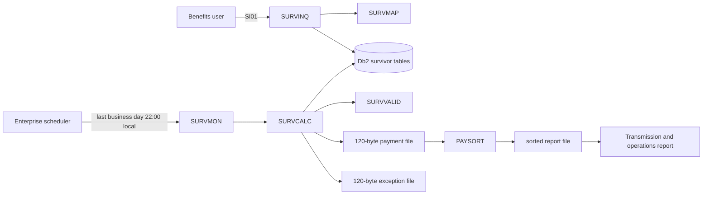

# SURVDEMO system analysis

## Scope and confidence

This assessment covers the extracted `DEV1/SURVDEMO` application: the SI01 CICS inquiry transaction, monthly SURVMON batch flow, shared SURVVALID validation subprogram, BMS map, copybooks, Db2 schema, control cards, procedure, and schedule definition. The source is internally coherent enough to plan bounded modernization slices, but no extraction manifest, runtime traces, production configuration, data profile, or approved characterization results were available. Findings below are source-derived and are not yet proof of runtime parity.

## Capability map

| ID | Capability | Legacy entry point | Observable outcome | Primary evidence |
|---|---|---|---|---|
| TASK-SURV-001 | Survivor entitlement inquiry | CICS transaction SI01 / program SURVINQ | Displays beneficiary, relationship, monthly amount, dates, entitlement status, and a task message | `CSD/SURVCICS.txt`; `COBOL/SURVINQ.cbl` 003100-020000; `BMS/SURVMAP.bms` 000100-003400 |
| TASK-SURV-002 | Monthly benefit calculation | Scheduled job SURVMON / program SURVCALC | Creates payment and exception rows, updates entitlements and run status, emits payment and exception files, and returns RC 0, 4, or 12 | `SCHED/SURVFLOW.txt`; `JCL/SURVMON.jcl`; `PROC/SURVBAT.proc`; `COBOL/SURVCALC.cbl` 013500-053000 |
| TASK-SURV-003 | Payment report preparation | PAYRPT sort step | Retains detail records and sorts by claim and beneficiary with stable ordering | `JCL/SURVMON.jcl`; `CNTL/PAYSORT.ctl` |

## Dependency and flow model

SURVVALID is the only explicit dynamic program call in the extracted application and is shared business logic for calculation eligibility. SURVINQ does not call it; inquiry status formatting is a separate read-only concern.

## Recovered business rules

| Rule ID | Rule | Priority or calculation detail | Evidence |
|---|---|---|---|
| RULE-SURV-001 | Claim status must be active | First validation failure; reason C1 | `COBOL/SURVVALID.cbl` 002000-002400 |
| RULE-SURV-002 | Beneficiary status must be active | Second validation failure; reason B1 | `COBOL/SURVVALID.cbl` 002400-002600 |
| RULE-SURV-003 | Relationship must be SPS, CHD, or DEP | Third validation failure; reason R1 | `COBOL/SURVVALID.cbl` 002700-003100 |
| RULE-SURV-004 | Benefit percentage must be greater than 0 and at most 100 | Reason P1 | `COBOL/SURVVALID.cbl` 003200-003500 |
| RULE-SURV-005 | Other-income offset cannot be negative | Reason O1 | `COBOL/SURVVALID.cbl` 003600-003800 |
| RULE-SURV-006 | Base monthly benefit must be positive | Reason A1 | `COBOL/SURVVALID.cbl` 003900-004100 |
| RULE-SURV-007 | Family cap equals base monthly benefit times family maximum percentage divided by 100 | COBOL `ROUNDED`; exact compiler/runtime rounding semantics require characterization | `COBOL/SURVCALC.cbl` 029900-030600 |
| RULE-SURV-008 | Gross benefit equals base monthly benefit times beneficiary percentage divided by 100 | COBOL `ROUNDED` | `COBOL/SURVCALC.cbl` 032200-032500 |
| RULE-SURV-009 | Net benefit equals gross benefit minus other-income offset | Net less than or equal to zero produces Z1 | `COBOL/SURVCALC.cbl` 032200-033100 |
| RULE-SURV-010 | Only one payment is allowed per claim, beneficiary, and benefit month | Existing payment produces D1; Db2 also has a unique index | `COBOL/SURVCALC.cbl` 037100-039000; `DDL/SURVDB2.sql` unique index UX_PAY_PERIOD |
| RULE-SURV-011 | Family payments are allocated in beneficiary-ID order | A payment crossing the cap is reduced and marked C; later payments produce F1 | `COBOL/SURVCALC.cbl` 010100-013300 and 033300-035900 |
| RULE-SURV-012 | Entitlement updates use optimistic concurrency | Active row and matching VERSION_NO must update exactly one row | `COBOL/SURVCALC.cbl` 041600-043000 |
| RULE-SURV-013 | Inquiry validation requires claim ID before beneficiary ID | Blank inputs receive distinct messages in that priority order | `COBOL/SURVINQ.cbl` 005600-007600 |
| RULE-SURV-014 | Inquiry status/message priority is claim, beneficiary, then entitlement | Claim not approved overrides beneficiary and entitlement status; beneficiary ineligible overrides entitlement status | `COBOL/SURVINQ.cbl` 013300-015500 |
| RULE-SURV-015 | Batch completion severity is encoded in return code | 0 clean, 4 business exceptions, 12 technical failure; scheduler treats 8 or higher as stop | `COBOL/SURVCALC.cbl` 000500-000600 and 044800-053000; `SCHED/SURVFLOW.txt` |
| RULE-SURV-016 | Run creation is committed separately from calculation work | Technical failure rolls back work, marks the run F, and commits failure status | `COBOL/SURVCALC.cbl` 024300-025800 and 018800-019700 |

Validation is first-failure-wins in the order shown. C1, O1, A1, and unknown validation reasons use the generic exception text `ENTITLEMENT VALIDATION FAILED`; B1, R1, P1, D1, F1, and Z1 have specific text.

## Data and interface inventory

The Db2 schema contains seven tables: POLICY, SURVIVOR_CLAIM, BENEFICIARY, SURVIVOR_ENTITLEMENT, CALC_RUN, BENEFIT_PAYMENT, and CALC_EXCEPTION. Monetary values use `DECIMAL` with scale 2. Db2 `TIMESTAMP` columns must map to Azure SQL `datetime2`, not Azure SQL `timestamp`/`rowversion`. Fixed `CHAR` identifiers, blank padding, nullable END_DATE, identity behavior, status constraints, and the unique payment-period key require explicit source-to-target mappings.

The monthly input is one 20-character fixed record: calculation date `YYYYMMDD` plus a 12-character run ID. Payment output is a 120-character fixed file with H/D/T record types. Exception output is also 120 characters and pipe-delimited within a fixed record. PAYSORT retains only D records and sorts claim ID then beneficiary ID using `OPTION EQUALS`.

## Transaction and restart semantics

1. Insert CALC_RUN with status R and commit it independently.
2. Select eligible records as of the calculation date in claim/beneficiary order, using repeatable-read update locks.
3. For each entitlement, validate, check duplicate, calculate and cap, insert payment, then update the entitlement with a version check.
4. Write fixed payment or exception output and maintain control totals.
5. On success, write the trailer, mark CALC_RUN C, and commit all calculation database work.
6. On a technical failure, roll back calculation database work, mark the precommitted CALC_RUN F, commit that status, and return 12.

The scheduler instructs operators to use a new run ID after technical failure and verify both CALC_RUN and output dataset dispositions. Database rollback does not roll back already-written sequential output records, so failed-run file disposition and downstream suppression are essential parity concerns.

## UI behavior to preserve or intentionally redesign

SI01 is a single inquiry task. Initial focus is claim ID; claim ID length is 12 and beneficiary ID length is 10. Enter submits and PF3 exits. Results are protected fields. A target React page can use labeled inputs, an explicit Inquire button, accessible field errors, a result region, and a Cancel/Close action without reproducing the 3270 layout. Any changes to validation timing, message wording, keyboard behavior, or retained last IDs require business and UX approval.

## Material risks and unknowns

| Risk ID | Gap | Impact and evidence required |
|---|---|---|
| RISK-SURV-001 | No sanitized legacy input/output/post-state oracle | Blocks parity claims; capture inquiry cases, monthly run data, database before/after images, both files, report output, messages, and return codes |
| RISK-SURV-002 | No extraction manifest, hashes, CCSID, RECFM metadata, compiler options, or source revision | Blocks evidence-reconciliation gate and exact numeric/encoding conclusions |
| RISK-SURV-003 | No authorization definition beyond EIBUSERID capture | CICS resource security and data-access policy must be supplied; UI visibility is not authorization |
| RISK-SURV-004 | No downstream transmission/report contracts | Fixed-file replacement or retention cannot be decided safely; obtain consumer layouts, delivery protocol, acknowledgements, and rerun behavior |
| RISK-SURV-005 | No production volumes or concurrency profile | Payment-ID four-digit sequence, 10/30-minute windows, locking, pool sizing, and query plans cannot be validated |
| RISK-SURV-006 | No approved target scheduler/hosting/coexistence decision | Requires ADR covering enterprise scheduler integration versus an Azure-native job host, identity, retries, and overlap prevention |
| RISK-SURV-007 | No source data profile for blanks, padding, invalid constrained values, dates, or decimals | Blocks final Azure SQL collation, cleansing, and migration decisions |
| RISK-SURV-008 | SQL and file error observability is minimal | Target unexpected-error handling must log the cause and correlation/run ID while returning safe user errors |

## Assessment conclusion

SURVDEMO is a good candidate for incremental modernization as a Spring Boot modular monolith with one React inquiry feature and a separately invocable batch application path sharing dependency-free domain rules. The smallest useful release is the read-only inquiry after the data contract is approved. The monthly calculation should follow only after exact rule characterization because ordering, decimal rounding, transactions, optimistic concurrency, fixed files, restart, and return-code behavior are tightly coupled.