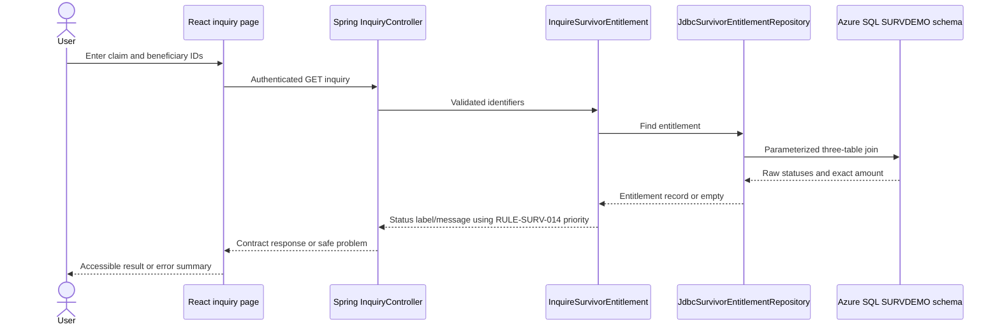

# TASK-SURV-001 target architecture

## Traceable request path

## Ownership boundaries

| Tier | Owns | Must not own |
|---|---|---|
| React | Form usability, client syntax feedback, async state, display formatting, focus and announcements | Authoritative status priority, authorization, SQL shapes, monetary arithmetic |
| Spring API | HTTP validation, contract mapping, authentication/authorization, correlation and safe errors | Database entities exposed as contracts |
| Spring application/domain | Identifier invariants and legacy status/message priority | Spring, HTTP, JDBC, or Azure types in domain records |
| JDBC adapter | Parameterized query, trimming fixed identifiers, exact decimal/date mapping | User messages or authorization decisions |
| Azure SQL | Keys, data integrity, source-compatible precision and query indexes | Browser access or production schema generation by ORM |

## Slice traceability

| Legacy behavior | Target mapping | Test mapping |
|---|---|---|
| TASK-SURV-001 / SI01 inquiry | React `SurvivorInquiryPage`, GET inquiry operation, application inquiry service | React component tests, controller tests, JDBC integration test |
| RULE-SURV-013 required IDs | API/domain identifier validation and React usability validation | Validation tests and form tests |
| RULE-SURV-014 claim-beneficiary-entitlement status priority | `EntitlementPresentation` domain policy | One unit test per priority/status branch |
| Not found message | 404 `SURV-ENTITLEMENT-NOT-FOUND`; React error summary | Controller and component tests |
| Db2 failure message | 503 `SURV-SERVICE-UNAVAILABLE`; cause logged with correlation ID | API exception-handler test |
| PF3 exit | Explicit Clear action; route navigation remains an approved UX decision | Keyboard/component test |

## Known parity boundaries

- The legacy keeps claim and beneficiary IDs in a 32-byte COMMAREA between terminal interactions. The web form keeps values only in component state; refresh persistence is intentionally not added without UX approval.
- The legacy displays the beneficiary name in 30 characters although Db2 stores 60. The API returns all 60; the React page displays the full value. This accessibility-oriented change requires business approval.
- Legacy message text and status priority are preserved. HTTP status codes and structured problems are new transport behavior.