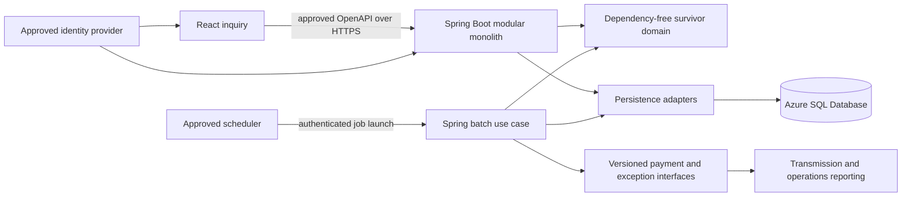

# SURVDEMO modernization plan

## Objective

Replace SURVDEMO incrementally with a React and TypeScript inquiry experience, a Spring Boot application containing dependency-free survivor-benefit domain rules and batch orchestration, and an Azure SQL Database schema. Preserve observable business, database, file, scheduling, restart, and failure behavior unless an approved requirement records an intentional change.

This is a planning baseline, not an implementation approval. Entry requires resolution or explicit acceptance of the evidence gaps in `analysis/survdemo-system-analysis.md`.

## Target shape

React never accesses Azure SQL. Spring owns authoritative validation, calculations, authorization, transaction boundaries, idempotency, and concurrency. Production schema changes are versioned migrations; ORM automatic schema creation is disabled outside disposable tests.

## Delivery sequence

### WP-SURV-00: Evidence, ownership, and behavior oracle

**Scope:** Reconcile the extraction and establish the approved behavior baseline before target code.

- Record source revision, hashes, encoding, fixed-record metadata, compiler/runtime options, owners, scope, and exclusions.
- Capture sanitized inquiry success/not-found/status/error cases.
- Capture monthly clean, each business exception, cap crossing, duplicate, version conflict, SQL/file failure, rollback, restart, and stable-sort cases.
- Capture database before/after state, H/D/T payment file, exception file, sorted report, console totals, and return codes.
- Confirm scheduler calendar/time-zone/DST behavior, predecessors, successors, batch window, and abort authority.
- Produce stable TASK, RULE, IFACE, DATA, and TEST IDs and approve tolerances for nondeterministic timestamps.

**Exit gate:** Evidence coverage is reconciled, the first slices have executable oracle cases, and missing inputs that can change behavior have owners and due decisions.

### WP-SURV-01: Contracts, ADRs, and Azure SQL mapping

**Scope:** Approve boundaries before frontend and backend implementation.

- Create ADRs for React toolchain, LTS Java/Spring baseline, modular-monolith structure, OpenAPI/error versioning, identity, hosting, scheduler, persistence/migrations, local SQL testing, observability, and cutover.
- Define `GET /api/v1/survivor-entitlements/{claimId}/beneficiaries/{beneficiaryId}` or an equivalent approved inquiry operation, including not-found, validation, forbidden, conflict, and unavailable errors with correlation IDs.
- Keep monetary API values as exact decimal strings and dates as ISO local dates with explicit semantics.
- Build a source-to-target map for all seven tables, constraints, indexes, identity, `CHAR` padding, null/blank behavior, and Db2 `TIMESTAMP` to Azure SQL `datetime2`.
- Decide whether the fixed 120-byte files remain contractual outputs during coexistence; do not replace them until downstream owners approve a new interface.
- Threat-model inquiry data, scheduler launch, batch output, logs, and operational access.

**Exit gate:** UI, API, error, identity, database, batch, file, and transaction contracts are approved and traceable.

### WP-SURV-02: Shared validation domain

**Scope:** Convert SURVVALID once as a dependency-free Java domain service used by batch and any future write workflows.

- Implement RULE-SURV-001 through RULE-SURV-006 with first-failure priority and exact reason codes.
- Use `BigDecimal` with explicit scale and approved rounding; include boundary and invalid-value characterization tests.
- Keep the class free of Spring, HTTP, ORM, scheduler, and Azure types.
- Map every rule to exact oracle expectations, including generic versus specific exception messages.

**Exit gate:** Domain tests pass against approved legacy cases and rule traceability is complete.

### WP-SURV-03: Read-only inquiry vertical slice

**Scope:** Modernize SI01 end to end as the first deployable capability.

- Implement the approved Azure SQL baseline migration and load a sanitized test dataset through a repeatable migration/test-data path.
- Implement a query repository that preserves fixed identifier semantics and nullable end date behavior.
- Implement inquiry formatting/status priority RULE-SURV-013 and RULE-SURV-014 in the Spring application/domain layer.
- Implement the OpenAPI operation and safe error handler with cause and correlation-ID logging.
- Generate TypeScript API types from the contract.
- Build an accessible React route with claim and beneficiary inputs, explicit submit/cancel actions, loading/empty/result/error states, focus management, and keyboard operation.
- Run unit, repository integration, OpenAPI contract, React component/accessibility, browser-to-database E2E, authorization, and differential parity tests.

**Exit gate:** Approved inquiry oracle cases pass through the real browser/API/database path on clean local SQL Server and Azure SQL Database test environments; UX and security owners approve intentional terminal-to-web changes.

### WP-SURV-04: Monthly calculation domain engine

**Scope:** Recover calculation behavior without database, file, or scheduler dependencies.

- Model calculation date, benefit month, entitlement input, payment decision, exception decision, family allocation state, and run totals as explicit domain types.
- Implement RULE-SURV-007 through RULE-SURV-011 using approved decimal rounding and beneficiary ordering.
- Characterize cap-at-boundary, cap crossing, zero/negative net, duplicate, all validation failures, multiple beneficiaries, and more than 9,999 payments.
- Produce deterministic payment/exception decisions that adapters can persist and render into legacy files.

**Exit gate:** Exact expected values, ordering, statuses, reason codes, and totals match the approved oracle independently of infrastructure.

### WP-SURV-05: Batch persistence, files, and orchestration

**Scope:** Implement SURVCALC and PAYRPT behavior around the verified domain engine.

- Implement eligible-entitlement selection with approved Azure SQL isolation/locking and deterministic claim/beneficiary order.
- Enforce the unique benefit-period key and RULE-SURV-012 optimistic version update requiring exactly one affected row.
- Preserve RULE-SURV-016: separately commit run status R; atomically commit calculation database work and status C; on technical failure roll back work, mark the run F, and commit the failure status.
- Make launches idempotent and reject/serialize overlapping benefit-month runs according to an approved policy.
- Generate and byte-validate the 20-character control input interpretation, 120-character H/D/T payment output, 120-character exception output, and stable sorted detail report while legacy consumers remain.
- Preserve the result ladder equivalent to RC 0, 4, and technical failure 12 in the scheduler contract.
- Log run ID and correlation ID with protected-data redaction; emit run counts, totals, duration, exception counts, and failure metrics.
- Add database integration, rollback, deadlock/retry, file golden-master, restart, rerun, query-plan, concurrency, and batch-window tests.

**Exit gate:** Database post-state, files, totals, statuses, return outcomes, rollback, restart, and ordering match approved cases on a clean full migration chain and Azure SQL Database.

### WP-SURV-06: Scheduler, coexistence, and operational readiness

**Scope:** Integrate the batch into the approved operating model without breaking predecessor/successor contracts.

- Connect the enterprise scheduler or approved Azure job host using managed identity or another approved non-secret credential flow.
- Preserve last-US-business-day 22:00-local semantics, predecessor gating, 10-minute expected/30-minute maximum windows, and successor suppression on technical failure.
- Build dashboards and alerts for overdue/missing runs, failures, business exceptions, count/amount reconciliation, duration, and downstream delivery.
- Rehearse deployment, schema migration, failed-run cleanup, file handling, database recovery, application rollback, and legacy fallback.
- Run legacy and target in an approved shadow/parallel mode and compare database effects and files without double-paying beneficiaries.

**Exit gate:** Security, performance, resilience, operations, reconciliation, rollback, and support runbooks are approved; abort thresholds and decision owners are named.

### WP-SURV-07: Incremental cutover and decommission

**Scope:** Cut over inquiry and batch independently.

- Route a controlled inquiry cohort to React/Spring first, observe parity and service levels, then expand.
- Cut over monthly calculation only after a successful dress rehearsal and approved parallel-run evidence.
- Keep legacy fallback available for the approved observation period; prevent both calculators from committing the same benefit month.
- Retire SI01, SURVMON, datasets, Db2 objects, and scheduler definitions only after retention, audit, legal hold, downstream, and support approvals.

**Exit gate:** Reconciliation is accepted, no critical mismatches remain, fallback expiry is approved, and decommission evidence is retained.

## Verification matrix

| Layer | Minimum proof |
|---|---|
| Domain | Exact validation priority, reason codes, decimal values, cap allocation, statuses, and totals against legacy oracle cases |
| API | OpenAPI compatibility, exact decimal/date representation, safe errors, authorization, correlation, and no persistence-model leakage |
| React | Task completion, field constraints, result and error states, keyboard/focus behavior, screen-reader announcements, responsive layout, and permission states |
| Azure SQL | Full clean migration, source-to-target schema diff, constraints/indexes, data migration reconciliation, query plans, isolation, locks, concurrency, rollback, and recovery |
| Batch/files | Eligibility ordering, duplicate prevention, optimistic update, transaction boundaries, fixed bytes, stable sorting, control totals, return outcomes, restart, and rerun |
| Integrated | Browser/API/database inquiry and scheduler/domain/database/file monthly flow, including unavailable, conflict, partial failure, retry, and recovery cases |
| Nonfunctional | Accessibility, threat model, dependency/security scans, redaction, batch window, load, transient faults, observability, deployment, and rollback rehearsal |

## Required approvals before implementation

1. Business owner: rule priority, status/message semantics, decimal rounding, family-cap allocation, and intentional UX changes.
2. Mainframe and operations owners: extraction completeness, file layouts, scheduler semantics, return outcomes, restart, and fallback.
3. Data owner: source-to-target mapping, cleansing, retention, reconciliation, collation, and null/blank rules.
4. Security owner: identity, authorization, protected-data handling, audit, service-to-service launch, and least privilege.
5. Architecture/platform owners: approved LTS versions, hosting, scheduler, migration tool, local container policy, Azure SQL configuration, and observability.
6. Downstream owners: payment transmission and operations-report interface compatibility and cutover timing.

## Rollback principles

- Inquiry rollback is independent: restore routing to SI01 while retaining target logs and read-only Azure SQL data for diagnosis.
- Batch rollback occurs only before target results are released downstream, unless a business-approved compensating process exists.
- Database migrations require tested forward-fix and recovery procedures; destructive down-migrations are not assumed safe.
- A failed target batch must not trigger successors. Reconcile CALC_RUN, payment/exception rows, entitlement versions, and all files before retrying with the approved run-ID policy.
- Keep a single writer for each benefit month throughout coexistence to prevent duplicate or divergent payments.

## Recommended first work packet

Start with WP-SURV-00 and produce the inquiry oracle plus the shared-validator oracle. This is the smallest work that can falsify the current source-derived understanding before technology choices become expensive. Do not scaffold the target application until the extraction and contract gates are accepted.